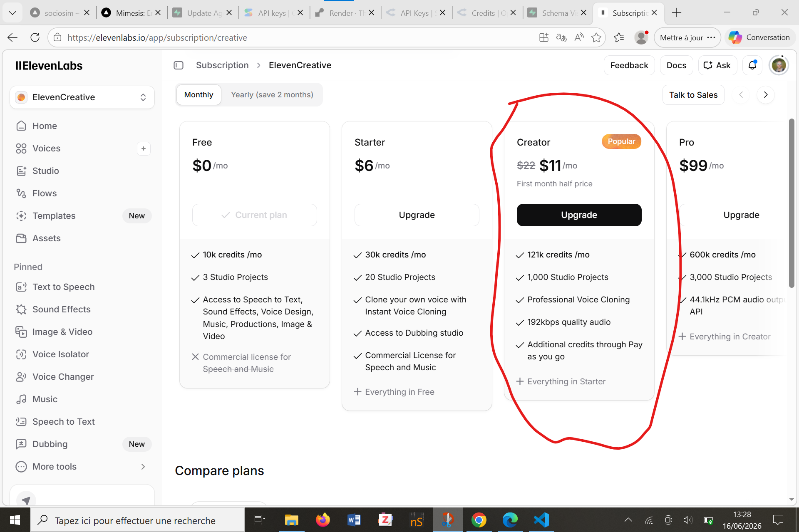

# VOICE_PHASE_1_PLAN.md

> Cahier de charges — Phase 1 du système de voix Mimesis.
> **À lire en premier** par tout agent (Claude, Codex, autre) ou humain qui reprend ce chantier.
> Maintenu à jour à chaque étape complétée. Date de création : 2026-06-16.

---

## 1. Contexte général

Mimesis (SocioSim) est un simulateur d'entretien sociologique destiné aux étudiants en sciences sociales (M2). Le projet est en ligne, le prof n'a pas encore donné son retour final. On passe maintenant à la première grosse fonctionnalité produit : **donner une voix aux personas**, inspiré de Character.ai.

L'objectif n'est PAS de tout livrer en une fois. L'objectif de la **Phase 1** est de :
1. Construire une architecture voix propre, non jetable, qui scalera plus tard sur les 10 personas
2. Faire fonctionner **une seule persona** (Jade) bout-en-bout
3. Démontrer la vision au prof avec une démo crédible

**Deadline cible : vendredi 19 juin 2026 au soir.**

---

## 2. Vision produit — décisions actées

### Distinction "personas vitrine" vs "personas utilisateur"
- **Vitrine** : créés par l'équipe SocioSim, affichés sur l'accueil + bibliothèque publique. Exemples : **Jade, Théo, Oriane**. Voix fixée éditorialement par l'admin, jamais modifiable par l'étudiant. Identifiés en DB par `agents.is_template = true`.
- **Utilisateur** : créés par les M2 dans l'interface "Créer un persona". L'utilisateur définit les caractéristiques (nom, âge, milieu, etc.) puis choisit une voix. Identifiés par `agents.is_template = false`.

### La voix EST une identité, pas un choix
- Une persona = une voix unique, fixée.
- L'étudiant n'a JAMAIS le choix de la voix dans le chat. Cohérence sociologique : Jade EST quelqu'un, elle a UNE voix.
- C'est l'admin (toi) qui fait le choix éditorial en amont, en testant 3-5 candidates dans le catalogue ElevenLabs.

### Workflow futur pour les personas utilisateur (Phase 2 — hors scope actuel)
1. L'étudiant remplit les caractéristiques sociologiques du persona
2. Le système filtre le catalogue ElevenLabs (genre, âge, accent, ton)
3. Audition : 3-5 voix candidates avec la première phrase du persona générée pour chacune
4. L'étudiant écoute et choisit
5. La voix est attribuée définitivement à ce persona
6. Justifier le choix de voix devient un **exercice méthodologique** (à documenter dans un mémo de recherche)

---

## 3. Scope strict — Phase 1

### ✅ Ce qu'on fait en Phase 1
- Une seule persona : **Jade** (vitrine, `is_template = true`)
- Schéma DB pour stocker la voix par persona (colonne `voice_profile` jsonb)
- Bucket Supabase Storage pour cache audio (`voice-cache`)
- Route API serveur `/api/voice/tts` (POST `{agentId, text}` → `{audioUrl, cached}`)
- Composant `<VoicePlayer />` réutilisable (3 endroits)
- **Preview voix sur carte Jade** sur l'accueil et sur `/personnas`
- **Lecture des messages persona** dans `/interview` (bouton ▶️ par message)
- **Toggle "Lecture automatique"** dans le header de `/interview` (OFF par défaut, persistant en localStorage)
- Pour Oriane et Théo : badge "Voix bientôt disponible", pas de bouton

### ❌ Ce qu'on NE fait PAS en Phase 1 (renvoyé en Phase 2/3)
- Interface de sélection/audition de voix lors de la création d'un persona utilisateur
- Filtrage automatique du catalogue ElevenLabs selon attributs sociologiques
- Voix pour Oriane et Théo (placeholder uniquement)
- Micro utilisateur / Speech-to-Text
- Mode conversation vocale temps réel (Realtime API, WebRTC, etc.)
- Animation waveform avancée pendant que le persona parle
- Abstraction multi-provider (on commit sur ElevenLabs uniquement, on extraira si besoin plus tard)

---

## 4. Décisions techniques

### Provider
- **ElevenLabs uniquement** en Phase 1
- **Plan Creator (11 €/mois)** : 100 000 caractères/mois, accès aux voix premium
- Clé `ELEVENLABS_API_KEY` côté serveur uniquement, jamais exposée au client

### Cache obligatoire
- Tous les audios générés sont mis en cache dans Supabase Storage
- **Clé de cache** : `sha256(voiceId + text)` → un même texte avec la même voix n'est généré qu'UNE FOIS
- **Structure du bucket** :
  ```
  voice-cache/
  ├── previews/
  │   └── jade.mp3                ← échantillon fixe pour la carte, pré-généré 1 fois
  └── tts/
      └── {voiceId}/
          └── {hash}.mp3          ← cache des réponses chat
  ```

### Garde-fous coûts
- **Limite 600 caractères** par requête TTS (route renvoie 400 si dépassement)
- **Autoplay OFF par défaut** dans `/interview` (toggle persistant en localStorage)
- **Preview Jade pré-généré** une seule fois, jamais re-généré (option A)

### Schéma DB
Ajout d'une colonne `voice_profile` (jsonb, nullable) à la table `agents`.

```json
{
  "provider": "elevenlabs",
  "voiceId": "21m00Tcm4TlvDq8ikWAM",
  "displayName": "Jeune femme calme - parisienne",
  "language": "fr",
  "settings": {
    "stability": 0.5,
    "similarity_boost": 0.75,
    "speed": 1.0
  },
  "previewAudioPath": "previews/jade.mp3"
}
```

`NULL` = pas de voix configurée → l'UI affiche "Voix bientôt".

### Sécurité
- Clé API ElevenLabs jamais côté client
- Vérification de l'authentification Supabase sur la route `/api/voice/tts`
- Pas de TTS arbitraire : seul un texte associé à un `agentId` valide est accepté

---

## 5. Architecture des fichiers

### Fichiers à créer
| Fichier | Rôle |
|---|---|
| `supabase/migrations/20260616_add_agents_voice_profile.sql` | ✅ **Créé** — ajoute la colonne `voice_profile` |
| `src/app/api/voice/tts/route.ts` | ⏳ Route serveur ElevenLabs + cache |
| `src/lib/voice/elevenlabs.ts` | ⏳ Client ElevenLabs minimal (fetch + types) |
| `src/lib/voice/cache.ts` | ⏳ Helpers cache Supabase Storage (hash, lookup, upload) |
| `src/components/VoicePlayer.tsx` | ⏳ Composant React (mode `preview` ou `tts`) |
| `scripts/generate-jade-preview.ts` | ⏳ Script one-shot pour générer le preview de Jade |
| `docs/voice/JADE_VOICE_DECISION.md` | ⏳ Doc qui justifie le choix de la voix de Jade (à remplir après audition) |

### Fichiers à modifier
| Fichier | Modification |
|---|---|
| `src/app/components/PersonaShowcaseCard.tsx` | Ajouter `<VoicePlayer mode="preview" />` sous le nom de Jade. Badge "Voix bientôt" pour Oriane/Théo |
| `src/app/personnas/components/AgentCard.tsx` | Idem côté liste personas |
| `src/components/ChatMessage.tsx` | Bouton ▶️ sous chaque message `role=assistant` (mode `tts`) |
| `src/app/components/InterviewLayout.tsx` | Toggle "Lecture automatique" dans le header |
| `src/lib/data/agents.ts` | Étendre `AgentRecord` avec `voice_profile?: VoiceProfile \| null` |
| `.env.local.example` | Ajouter `ELEVENLABS_API_KEY=` |
| `CHANGELOG.md` | Documenter les changements voix |

### Fichiers à NE PAS modifier
- `src/lib/supabaseServiceClient.ts` (déjà OK)
- Le service ADK Agent (Python, port 8000) — la voix est complètement indépendante du chat backend
- Aucune route existante (`/api/interviews/*`, `/api/agents/*`, etc.)

---

## 6. Découpage en sous-étapes

État au 2026-06-16 (mis à jour à chaque étape complétée).

| # | Sous-étape | Qui | Statut |
|---|---|---|---|
| A | Créer la branche `feat/voice-phase-1` à partir de `main` | Claude | ✅ Fait |
| B | Écrire le fichier de migration SQL (`20260616_add_agents_voice_profile.sql`) | Claude | ✅ Fait |
| C | Upgrader compte ElevenLabs en Creator + récupérer la clé API + la mettre dans `.env.local` | Utilisateur | ✅ Fait |
| D | Appliquer la migration dans Supabase SQL editor (interface web) | Utilisateur | ✅ Fait |
| E | Créer le bucket `voice-cache` dans Supabase Storage (interface web) | Utilisateur | ✅ Fait |
| F | Écrire la route `/api/voice/tts` + helpers `elevenlabs.ts` + `cache.ts` + types | Claude | ✅ Fait |
| G1 | Audition des voix candidates pour Jade (script + écoute) | Utilisateur (script fourni) | ⏳ En cours |
| G2 | Set voice_profile de Jade en DB (SQL UPDATE) | Utilisateur (SQL fourni) | Pending |
| G3 | Générer le preview officiel de Jade + uploader dans le bucket | Utilisateur (script fourni) | Pending |
| H | Écrire le composant `<VoicePlayer />` | Claude | Pending |
| I | Intégrer `<VoicePlayer />` dans `PersonaShowcaseCard` (accueil) | Claude | Pending |
| J | Intégrer `<VoicePlayer />` dans `AgentCard` (`/personnas`) | Claude | Pending |
| K | Ajouter bouton ▶️ dans `ChatMessage` + appel TTS | Claude | Pending |
| L | Ajouter toggle "Lecture automatique" dans `InterviewLayout` | Claude | Pending |
| M | `npm run typecheck` + `npm run lint` + `npm run build` | Claude | Pending |
| N | Tests manuels bout-en-bout (vérifier que rien n'est cassé) | Utilisateur | Pending |
| O | Mise à jour du CHANGELOG.md | Claude | Pending |
| P | Commit + push (si validation utilisateur) | Claude | Pending |

---

## 7. Séparation des rôles

### Ce que l'agent (Claude/Codex) fait
- Écrit tous les fichiers `.sql`, `.ts`, `.tsx`
- Met à jour `.env.local.example`, `CHANGELOG.md`, ce plan
- Lance typecheck/lint/build
- Ne touche JAMAIS à Supabase (interface web), à ElevenLabs (compte), ou aux secrets

### Ce que l'utilisateur fait (avec guidance pas-à-pas de l'agent)
- Upgrade compte ElevenLabs + récupère la clé API
- Ajoute `ELEVENLABS_API_KEY` dans `.env.local` (jamais commit)
- Applique la migration `.sql` dans Supabase SQL editor
- Crée le bucket `voice-cache` dans Supabase Storage (public en lecture, privé en écriture)
- Lance le script de génération du preview Jade
- Effectue les tests manuels

---

## 8. Variables d'environnement

À ajouter dans `.env.local` (utilisateur) ET dans `.env.local.example` (agent) :

```
# ElevenLabs API key (serveur uniquement, ne jamais exposer côté client)
ELEVENLABS_API_KEY=
```

---

## 9. Risques & garde-fous

| Risque | Mitigation |
|---|---|
| Explosion des coûts ElevenLabs | Limite 600 chars + cache obligatoire + autoplay OFF par défaut |
| Cache inefficace | Hash inclut le `voiceId` → réutilisation maximale |
| Casser les routes/exports/chat existants | Aucune route existante touchée, ajout uniquement |
| Panne ElevenLabs / quota dépassé | Route renvoie 503, composant affiche "Voix indisponible" (pas de crash) |
| Clé API leakée | `.env.local` dans `.gitignore`, clé jamais lue côté client |
| Migration appliquée sur prod par erreur | L'utilisateur applique manuellement quand il est prêt |

---

## 10. Tests manuels finaux (checklist)

À cocher en fin de Phase 1 :

- [ ] Le projet `npm run build` sans erreur
- [ ] `npm run typecheck` sans erreur
- [ ] `npm run lint` sans erreur
- [ ] La carte de Jade sur l'accueil affiche un bouton ▶️ qui joue son preview
- [ ] La carte de Jade dans `/personnas` affiche idem
- [ ] Les cartes d'Oriane et Théo affichent "Voix bientôt", pas de bouton
- [ ] Dans `/interview` avec Jade : les messages persona ont un bouton ▶️
- [ ] Cliquer sur ▶️ lit l'audio (génère la première fois, cache ensuite)
- [ ] Le toggle "Lecture automatique" est OFF par défaut
- [ ] Quand on l'active, les nouvelles réponses se lisent automatiquement
- [ ] Le toggle est mémorisé entre les sessions (localStorage)
- [ ] Si on désactive la clé `ELEVENLABS_API_KEY` (test), le bouton affiche "Voix indisponible" sans crasher
- [ ] Le chat fonctionne normalement (pas de régression sur le streaming, les exports, l'analyse, etc.)
- [ ] Les autres pages (`/login`, `/personnas`, `/dashboard`, etc.) fonctionnent normalement

---

## 11. Vision long terme (rappel)

| Phase | Objectif | Statut |
|---|---|---|
| **Phase 1** | Jade fonctionnelle bout-en-bout, architecture voix posée | ⏳ En cours |
| **Phase 2** | Voix pour Oriane et Théo + interface d'audition pour les personas utilisateur (filtrage catalogue) | À venir |
| **Phase 3** | Mode conversation vocale (micro utilisateur, STT, Realtime API ou pipeline STT→LLM→TTS) | Plus tard |
| **Phase 4** | Polish Character.ai : animations waveform, états "écoute/réflexion/parle" | Plus tard |

---

## 12. Documents liés

- **[ELEVENLABS_API_KEY_REFERENCE.md](ELEVENLABS_API_KEY_REFERENCE.md) — Référence complète des permissions ElevenLabs** (catalogue exhaustif des endpoints, scénarios futurs, sécurité). À consulter si on veut activer une nouvelle permission ou modifier la clé.
- **[JADE_VOICE_DECISION.md](JADE_VOICE_DECISION.md) — Processus de choix de la voix de Jade** (critères, candidates, script d'audition, décision finale). À consulter ou mettre à jour à chaque changement de voix.
- [CHANGELOG.md](../../CHANGELOG.md) — historique des changements
- [docs/recovery/RECOVERY_CONTEXT_FOR_CODEX.md](../recovery/RECOVERY_CONTEXT_FOR_CODEX.md) — contexte général du projet
- [docs/specs/specification_stack_and_tools.md](../specs/specification_stack_and_tools.md) — stack technique
- [CLAUDE.md](../../CLAUDE.md) — règles du repo
- [AGENTS.md](../../AGENTS.md) — guidelines agents

---

## 13. Notes pour Codex (ou tout autre agent qui reprend)

Si tu reprends ce chantier :

1. **Lis CE document en premier**, puis le CHANGELOG et CLAUDE.md
2. **Vérifie où on en est** dans la section 6 (sous-étapes) — la dernière coche ✅ indique le point de reprise
3. **Ne réinvente rien** — toutes les décisions sont déjà prises (sections 2, 3, 4)
4. **Ne lance jamais** de migration ou d'action destructive sans validation utilisateur
5. **Ne fais qu'une chose à la fois** — l'utilisateur travaille avec un PC à RAM limitée. Pas de gros chantiers parallèles, pas de tests E2E lourds (cf. mémoire `feedback_method`)
6. **Ne push pas** sans demande explicite de l'utilisateur
7. **Quand tu termines une sous-étape** : mets à jour la section 6 (statut ✅) et la section "État courant" en bas

---

## 14. État courant

**Dernière mise à jour : 2026-06-17.**

- Branche active : `feat/voice-phase-1`
- Sous-étapes A → F terminées ✅
- Sous-étape en cours : **G1** (audition des 3 voix candidates pour Jade)
- Code voix backend : entièrement en place (route + helpers + types), bloqué par l'absence de `voice_profile` pour Jade en DB
- Bucket Supabase Storage `voice-cache` : créé
- Migration `voice_profile` : appliquée
- Clé ElevenLabs : configurée dans `.env.local`
- Script d'audition prêt : [scripts/audition-jade-voices.mjs](../../scripts/audition-jade-voices.mjs)
- Doc de la décision : [JADE_VOICE_DECISION.md](JADE_VOICE_DECISION.md)
- Aucun code voix encore livré
- Migration SQL prête à appliquer

---
